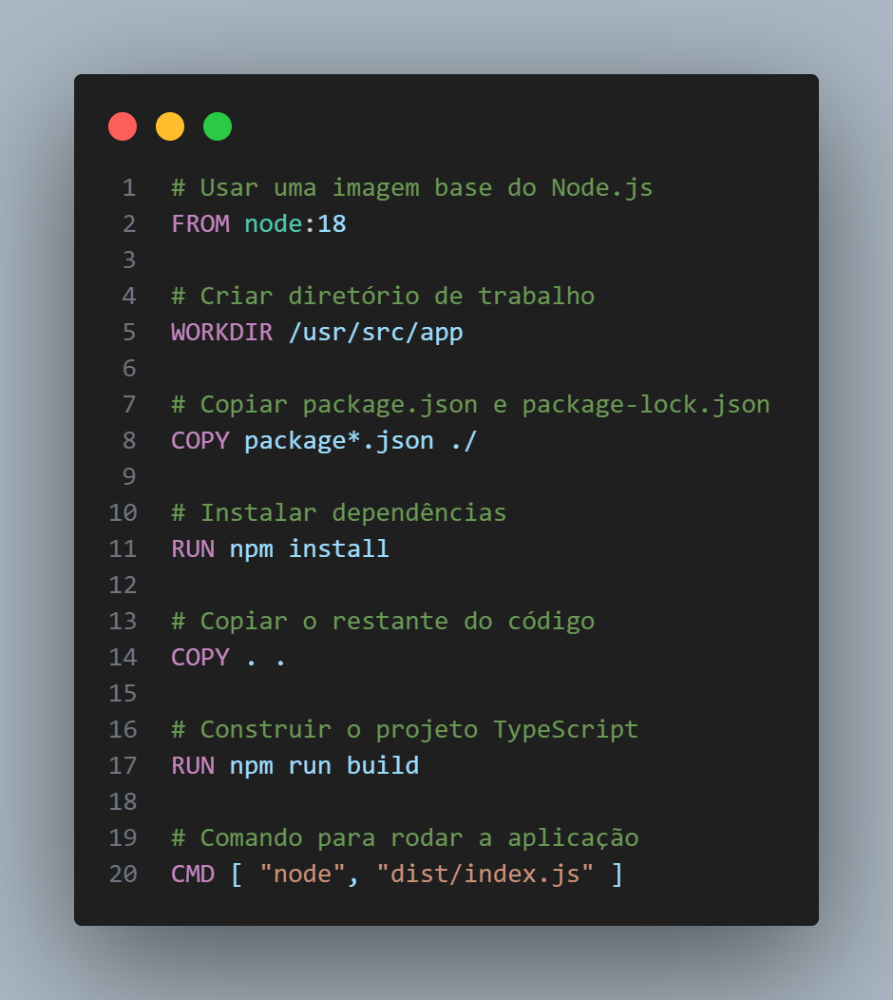
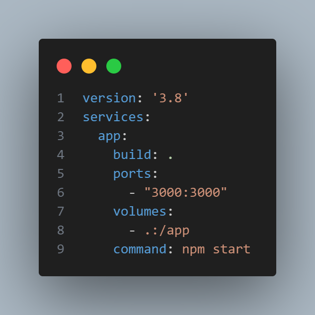

# Descrição do Pull Request

## Alunos
Vitor Fagundes
Guilherme Fonseca
William Ávila
Angelo Frighetto

## O que foi alterado

- [] Adição do código para que seja criado e impresso uma aplicação simples escrita em TypeScript.
- [] Criacao do docker para rodar o projeto.
- [] Adição de um arquivo de configuração para o docker.
- [] Adição de um arquivo de configuração para o docker-compose.

## Prints dos Códigos

## Configuração e Instalação

- [ ] Clone o repositório:
    - Abra o terminal e execute o seguinte comando para clonar o repositório:
    - git clone https://github.com/DevVitorFagundes/trabalho_final.git
    - `cd trabalho_final`
- [ ] Instale as dependências:
    - Certifique-se de ter o Node.js e o npm instalados. No diretório do seu projeto, execute o seguinte comando para instalar todas as dependências listadas no package.json:
    - `npm install`

- [] Rodar docker:
    - `docker-compose up`

## Descrição da Imagem Docker criada
A imagem Docker criada neste projeto é projetada para executar uma aplicação simples escrita em TypeScript. Esta aplicação imprime uma tabela de usuários utilizando o 'console.table'. A seguir, uma descrição detalhada dos componentes e o funcionamento da imagem Docker: